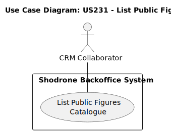
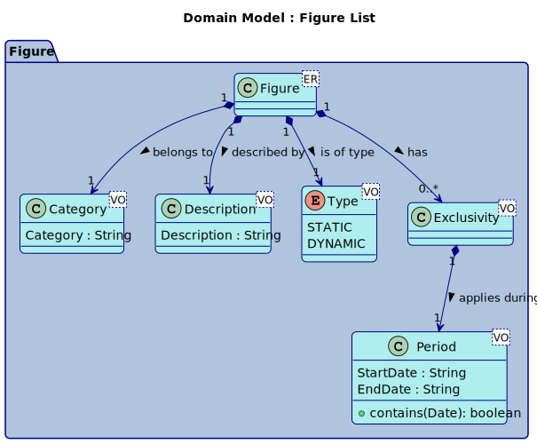
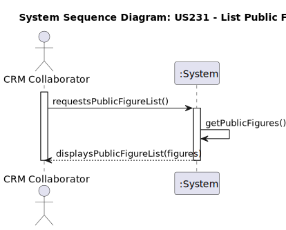
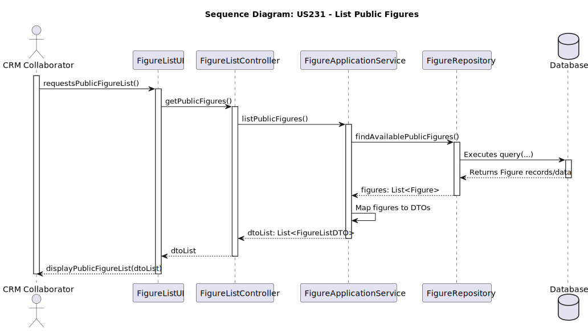
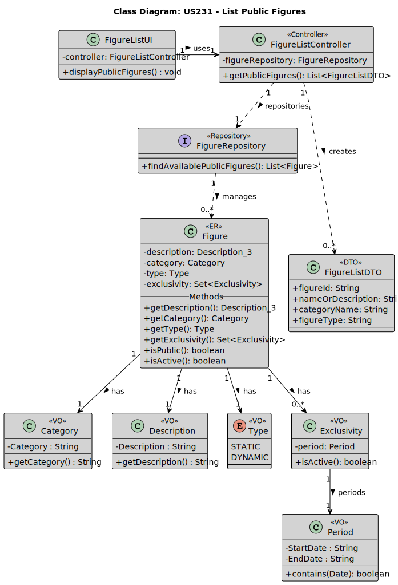

# US 231 - List Public Figures


## 1. Context

This User Story is being developed for the first time. The goal is to provide CRM Collaborators with the ability to view available public figures when they are constructing a show request proposal.
### 1.1 List of issues

Analysis: #47, #48 

Design: #49, #50

Implement: #51, #52, #53

Test: #54


## 2. Requirements


**US 231** As a CRM Collaborator, I want to list all public figures in the catalogue so that I can select them during a show request proposal. So that I can easily include relevant public figures in the show request proposals I create for customers.


**Acceptance Criteria:**

- US231.1 **Given** that I am logged in as a CRM Collaborator and I am in the process of creating a show request proposal, **When** I reach the section to include relevant figures, **Then** I should be able to access a list or catalogue of all public figures available in the system.


- US231.2 **Given** the list of public figures, **Then** for each figure, the list should display relevant information such as their name and potentially a brief description or category.


- US231.3 **Given** the need to select figures for the proposal, **Then** I should be able to easily select one or more public figures from the catalogue to associate with the show request proposal.


- US231.4 **Given** a potentially large catalogue of figures, **Then** the catalogue should be presented in a user-friendly manner, potentially with search or filtering options to help find specific figures.


- US231.5 **Given** the need for up-to-date information, **Then** the catalogue should reflect the current list of available public figures in the system.

**Dependencies/References:**

**US233 (Add Figure)**: This US depends on figures having been added to the system/catalogue.

**US234 (Decommission Figure):** Decommissioned figures should likely not appear in this list.

**US245/246/247/248 (Figure Categories):** Figures are associated with categories; the list might need to display the category or allow filtering/sorting by it.

**US230 (Register Show request) / US310 (Create Show Proposal) / US312 (Add figures to proposal):** This listing functionality is intended to be used within the context of creating or defining a show request/proposal.

*Regarding this requirement, we understand that:*
*   The list serves as a lookup for the CRM Collaborator.
*   The "public" status is dynamic based on Exclusivity periods.
*   The "active" status depends on the implementation details of decommissioning (US234).
*   Basic identifying and classifying information needs to be presented for each figure

## 3. Analysis




## 4. Design


### 4.1. Realization

### 4.2 Class Diagram


### 4.3. Applied Patterns

*   **Repository:** Abstracts data persistence logic for `Figure`.
*   **DTO (Data Transfer Object):** `FigureListDTO` is used to pass structured data to the presentation layer without exposing the domain entity.
*   **Layered Architecture:** Clear separation between Presentation (Controller, UI), Application (Service), Domain (Entities, VOs), and Persistence (Repository).
*   **Dependency Injection:** Assumed for injecting Repository into Service and Service into Controller.

### 4.4. Acceptance Tests

Include here the main tests used to validate the functionality. Focus on how they relate to the acceptance criteria. May be automated or manual tests.

**Test 1:** *Verifies that it is not possible to ...*

**Refers to Acceptance Criteria:** US101.1


```
@Test(expected = IllegalArgumentException.class)
public void ensureXxxxYyyy() {
	...
}
````

## 5. Implementation

*In this section the team should present, if necessary, some evidencies that the implementation is according to the design. It should also describe and explain other important artifacts necessary to fully understand the implementation like, for instance, configuration files.*

*It is also a best practice to include a listing (with a brief summary) of the major commits regarding this requirement.*

## 6. Integration/Demonstration

*In this section the team should describe the efforts realized in order to integrate this functionality with the other parts/components of the system*

*It is also important to explain any scripts or instructions required to execute an demonstrate this functionality*

## 7. Observations

*This section should be used to include any content that does not fit any of the previous sections.*

*The team should present here, for instance, a critical prespective on the developed work including the analysis of alternative solutioons or related works*

*The team should include in this section statements/references regarding third party works that were used in the development this work.*