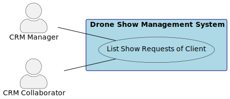
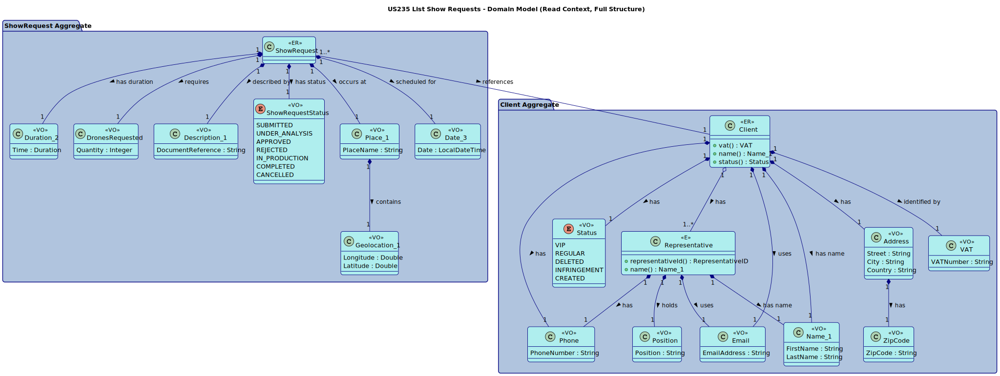
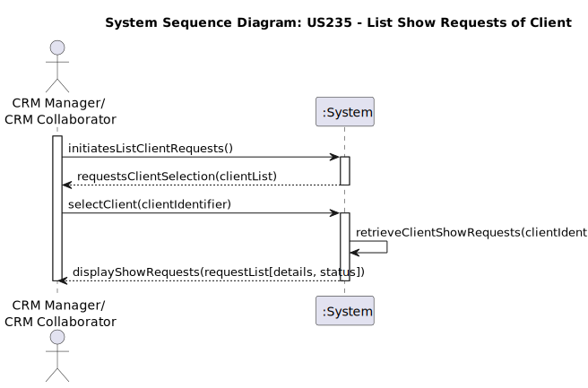
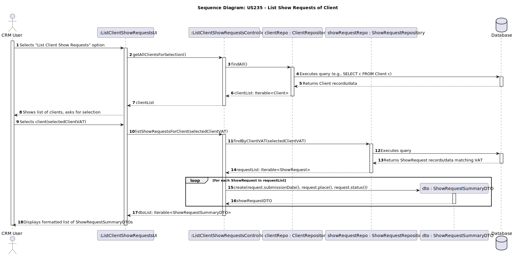
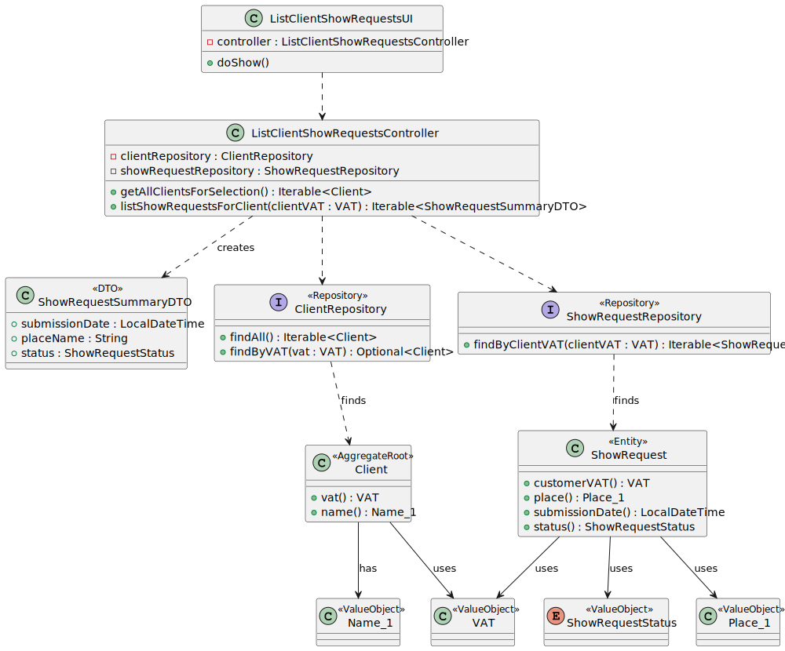

# US 235 List show requests of client

## 1. Context

This is the first time the task is assigned to be developed. The goal is to implement the functionality allowing CRM Managers and Collaborators to view a list of all show requests associated with a specific client, including the status of each request.

### 1.1 List of issues

*   **Analysis:** #81, #82
*   **Design:** #83 , #84
*   **Implementation:** #85
*   **Testing:** #86

## 2. Requirements

**US 235** As a CRM Manager or CRM Collaborator, I want to list all show requests of a client, So that I can have an overview of a client's requests.

**Acceptance Criteria:**

* Given a CRM Manager or CRM Collaborator with appropriate permissions,
    When they select a client in the system,
    Then the system should display a list of all show requests associated with that client.
* The list of show requests should include, for each request, at least its identifier, place, and the current status 

**Dependencies/References:**

*   This user story depends on the existence of clients in the system (US220 Register customer).
*   This user story depends on the existence of show requests associated with clients (US230 Register Show request).

## 3. Analysis

## 4. Design

### 4.1. Realization 

### 4.2. Class Diagram

### 4.3. Applied Patterns

*   **Controller:** Separates UI logic from application/domain logic (`ListClientShowRequestsController`).
*   **Repository:** Abstracts data persistence (`ClientRepository`, `ShowRequestRepository`).
*   **Data Transfer Object (DTO):** `ShowRequestSummaryDTO` is used to transfer a subset of data to the UI layer efficiently and without exposing domain entities directly.
*   **Value Object:** `VAT`, `ShowRequestStatus`, `Place_1`, `Name_1`.
*   **Entity:** `ShowRequest`.
*   **Aggregate Root:** `Client`.

### 4.4 Acceptance Tests

## 5. Implementation

## 6. Integration/Demonstration

## 7. Observations