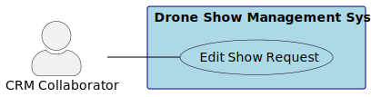
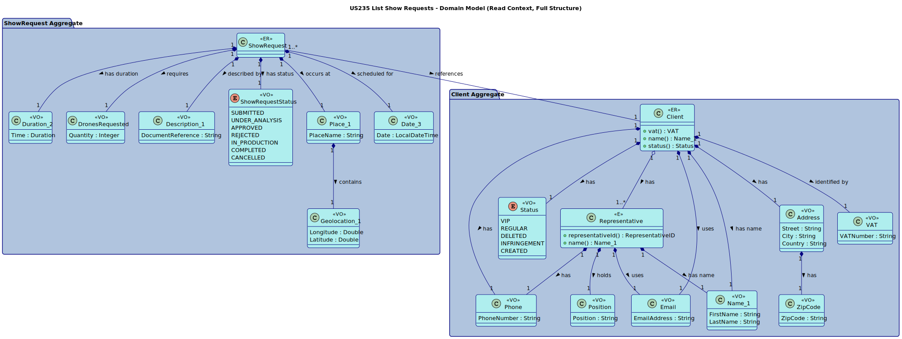

# US 236 Edit show requests

## 1. Context

This is the first time the task is assigned to be developed. The goal is to allow CRM Collaborators to modify the details of a client's show request, provided that the request has not yet progressed to the stage where a proposal has been created (indicated typically by its status).

### 1.1 List of issues

*   **Analysis:** #issue_number_analysis_us236
*   **Design:** #issue_number_design_us236
*   **Implementation:** #issue_number_implementation_us236
*   **Testing:** #issue_number_testing_us236

## 2. Requirements

**US 236** As a CRM Collaborator, I want to edit a show requests of a client, So that I can update the details of a request.

**Acceptance Criteria:**

* Given a CRM Collaborator with appropriate permissions,
  When they select a show request from a client that does not have an associated proposal,
  Then the system should allow them to edit the details of the show request.
* Given a show request already has a proposal associated with it, then the system should prevent editing.

**Dependencies/References:**

*   Depends on US220 (Clients exist).
*   Depends on US230 (Show Requests exist).

## 3. Analysis

## 4. Design

### 4.1. Realization

### 4.2. Class Diagram

### 4.3. Applied Patterns

*   **Controller:** `EditShowRequestController`.
*   **Repository:** `ClientRepository`, `ShowRequestRepository`.
*   **Value Object:** As defined in the domain model (`VAT`, `Place_1`, `Date_3`, etc.).
*   **Entity:** `ShowRequest`.
*   **Aggregate Root:** `Client`.

### 4.4 Acceptance Tests

## 5. Implementation

## 6. Integration/Demonstration

## 7. Observations

